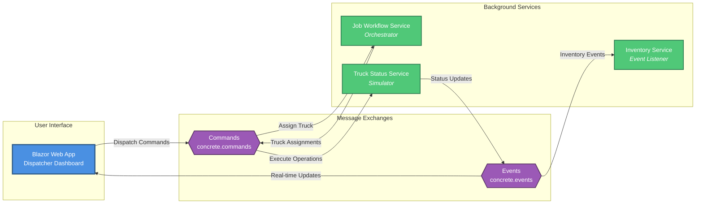
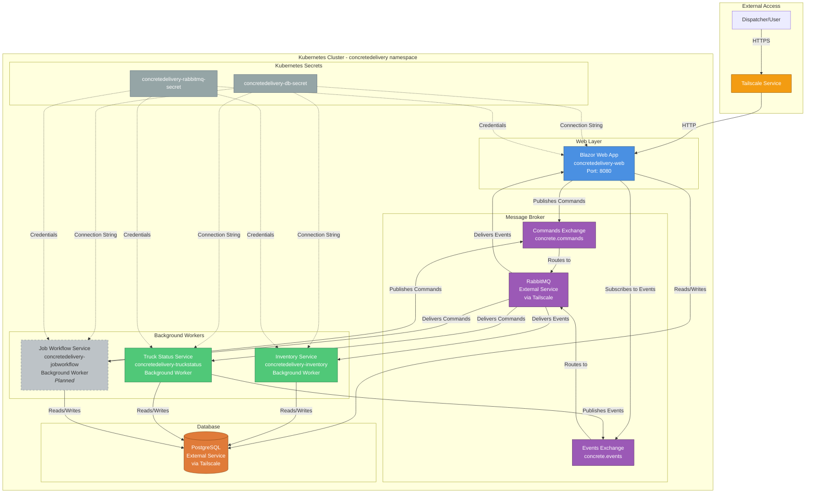

# Concrete Delivery System - Architecture Diagram

This document contains two views of the system architecture:
1. **High-Level Service Interaction** - Shows service-to-service communication patterns
2. **Detailed Kubernetes Deployment** - Shows all infrastructure components and connections

## High-Level Service Interaction

This diagram focuses on the core services and their message-based communication patterns.



### Message Flow Patterns

#### 1. Dispatcher Initiates Order
```
User → Web App → concrete.commands → Job Workflow Service
```

#### 2. Truck Assignment
```
Job Workflow Service → concrete.commands → Truck Status Service
```

#### 3. Truck Operations & Status Updates
```
Truck Status Service → concrete.events → Inventory Service (updates inventory)
                                       → Web App (updates dashboard)
```

### Service Responsibilities

| Service | Type | Purpose | Publishes | Consumes |
|---------|------|---------|-----------|----------|
| **Blazor Web App** | Web UI | Dispatcher dashboard, order management | Commands | Events |
| **Job Workflow Service** | Worker | Assigns trucks to orders, orchestrates workflow | Commands | Commands |
| **Truck Status Service** | Worker | Simulates truck operations through lifecycle | Events | Commands |
| **Inventory Service** | Worker | Manages plant material inventory | - | Events |

## Detailed Kubernetes Deployment

This diagram shows the components deployed to Kubernetes and how they interact.



## Component Descriptions

### Web Layer
- **Blazor Web App**: Dispatcher dashboard for managing trucks and deliveries
  - HTTP service accessible via Tailscale
  - Publishes commands to orchestrate truck operations
  - Subscribes to real-time status events
  - Direct database access for queries and updates

### Background Workers
- **Inventory Service**: Event-driven inventory management
  - Listens for truck status events (e.g., materials loaded)
  - Deducts materials from plant inventory
  - Updates PostgreSQL inventory tables
  
- **Truck Status Service**: Simulates truck operations
  - Consumes truck assignment commands
  - Simulates complete truck workflow with compressed timing
  - Publishes status events at each phase
  - Updates truck state in PostgreSQL
  
- **Job Workflow Service** *(Planned)*: Orchestration service
  - Assigns trucks to delivery orders
  - Publishes truck assignment commands
  - Manages job lifecycle

### Infrastructure
- **RabbitMQ**: Message broker for async communication
  - **concrete.commands**: Command messages for truck operations
  - **concrete.events**: Event messages for status changes
  - Hosted externally, accessed via Tailscale network
  
- **PostgreSQL**: Persistent data storage
  - Truck states and delivery history
  - Material inventory
  - Order information
  - Hosted externally, accessed via Tailscale network

### Configuration
- **concretedelivery-db-secret**: Database connection strings
- **concretedelivery-rabbitmq-secret**: RabbitMQ credentials (host, username, password)

## Message Flow Examples

### Command Flow: Assign Truck to Job
```
Dispatcher (Web UI) → concrete.commands → Job Workflow Service
                                       ↓
                          concrete.commands → Truck Status Service
```

### Event Flow: Truck Materials Loaded
```
Truck Status Service → concrete.events → Inventory Service (deducts materials)
                                       → Web UI (updates dashboard)
```

## Kubernetes Features Demonstrated

- **Service Discovery**: Services communicate via RabbitMQ and PostgreSQL using DNS names
- **Configuration Management**: Secrets for sensitive data (database credentials, RabbitMQ passwords)
- **Resource Management**: CPU/memory requests and limits on all services
- **Health Checks**: Liveness and readiness probes ensure service availability
- **Scaling**: Horizontal scaling capability for all services
- **Rolling Updates**: Zero-downtime deployments with ImagePullPolicy: Always
- **Namespace Isolation**: All resources in dedicated `concretedelivery` namespace
